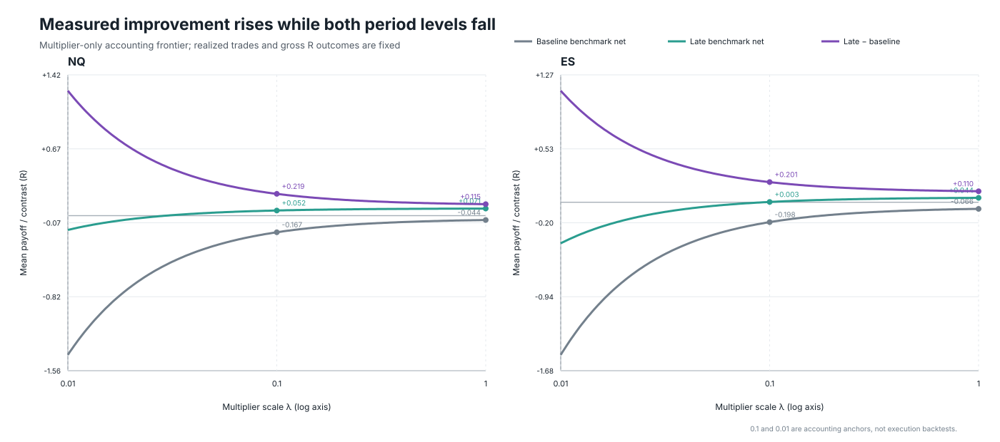

# Risk Normalization Does Not Imply Scale Invariance

[](https://papers.ssrn.com/sol3/papers.cfm?abstract_id=7388259)
[](https://doi.org/10.5281/zenodo.22230814)
[](https://orcid.org/0009-0001-1341-366X)
[](https://github.com/lgboim/risk-normalization-scale-invariance/actions/workflows/repository-quality.yml)
[](LICENSE-CODE.txt)
[](LICENSE-DOCUMENTATION-DATA.txt)

Research software, manuscript, and replication materials for:

> Ariel Elboim (2026), *Risk Normalization Does Not Imply Scale Invariance: Costs, Harmonic Width, and Eligibility in Futures Trading Rules*.

The paper studies a measurement problem in quantitative finance: expressing gross payoffs in risk units does not make implementation costs or absolute eligibility rules economically scale invariant. The empirical application uses E-mini Nasdaq-100 and E-mini S&P 500 futures opening-range trading rules as a laboratory; the contribution is the transformation framework, not a claim that the strategy identifies a structural break.

**Paper:** [SSRN abstract 7388259](https://papers.ssrn.com/sol3/papers.cfm?abstract_id=7388259) · **archived release:** [Zenodo 10.5281/zenodo.22230814](https://doi.org/10.5281/zenodo.22230814) · **author:** [ORCID 0009-0001-1341-366X](https://orcid.org/0009-0001-1341-366X)

The SSRN submission is under completeness review as of September 1, 2026. Zenodo is the citable, immutable archive for version 1.0. This GitHub repository is the maintained working view and will carry documented corrections and later releases.

## Why this matters

For normalized implementation cost

$$
\phi_i=\frac{\mathcal C_i}{n_iW_iV},
$$

invariance under contract-count, point-value, and width scaling requires the cost numerator to transform with dollar risk. A constant per-contract dollar component does not satisfy that condition. Its period-level drag is

$$
D_t=\frac{K}{V}\,E_t\!\left[\frac{1}{W_i}\right]
   =\frac{K}{VH_t},
$$

so the economically relevant aggregate is the **harmonic width**. Replacing it with arithmetic mean width systematically understates normalized fixed-dollar drag unless widths are constant.

The framework also separates two failure modes:

- cost scaling changes the economics of a fixed set of trades;
- point-denominated eligibility bounds can change the opportunity set itself.

Downscaling can therefore make normalized net levels worse in two periods while making the measured contrast between them larger, even though the realized gross risk-unit path is held fixed.



## Repository map

| Path | Purpose |
| --- | --- |
| [`paper/`](paper/) | Public working-paper PDF and Markdown source |
| [`outputs/figures/`](outputs/figures/) | Publication figures in SVG format |
| [`outputs/`](outputs/) | Final manuscript audit and archived manuscript source |
| [`work/research_factory/runs/diagnostics/`](work/research_factory/runs/diagnostics/) | Analysis, sensitivity, provenance, and figure-generation scripts and outputs |
| [`scale_invariance_public_replication_manifest.json`](scale_invariance_public_replication_manifest.json) | SHA-256 inventory for the archived public package |
| [`REPRODUCIBILITY.md`](REPRODUCIBILITY.md) | Data requirements, setup, verification, and full rebuild instructions |
| [`CITATION.cff`](CITATION.cff) | Machine-readable citation metadata |
| [`codemeta.json`](codemeta.json) | Machine-readable research-software metadata |

## Quick verification

The public package can be inspected and syntax-checked without licensed market data:

```bash
python -m compileall -q work/research_factory/runs/diagnostics
python work/research_factory/runs/diagnostics/reproduce_orb_scale_paper_package.py --manifest-only
```

The second command verifies the presence of the retained core artifacts and writes a local reproduction manifest. A complete numerical rebuild additionally requires independently licensed Sierra Chart source files at the paths documented in [`REPRODUCIBILITY.md`](REPRODUCIBILITY.md).

## Reproduce the analysis

Create an isolated environment and install the recorded Python dependencies:

```bash
python -m venv .venv
source .venv/bin/activate
python -m pip install --upgrade pip
python -m pip install -r requirements.txt
```

After placing the licensed canonical sources at the documented paths, run:

```bash
python work/research_factory/runs/diagnostics/reproduce_orb_scale_paper_package.py
```

The runner rebuilds the central derived outputs, sensitivity results, and three figures. The raw market data are not included because the underlying sources are commercially licensed. See [`REPRODUCIBILITY.md`](REPRODUCIBILITY.md) for the exact boundary between public verification and licensed-data reproduction.

## Research transparency

The repository includes the source-repair protocol, calendar reconciliation, chronology audit, eligibility-provenance audit, vendor-overlap audit, dependence sensitivities, execution-penalty sensitivity, analytical fee-scale grid, and public file hashes. The manuscript distinguishes exact accounting comparative statics from historical inference and from actual execution economics.

The raw contract-file inventory was not present when version 1.0 was built. Exact within-file duplicate minute timestamps in those licensed raw files were therefore not counted, and the paper does not infer that count from the duplicate-free continuous artifacts.

## Citation

Use GitHub's **Cite this repository** control, the metadata in [`CITATION.cff`](CITATION.cff), or cite the immutable Zenodo release:

> Elboim, A. (2026). *Replication companion for Risk Normalization Does Not Imply Scale Invariance* (Version 1.0). Zenodo. https://doi.org/10.5281/zenodo.22230814

For the argument and empirical results, cite the paper itself via [SSRN abstract 7388259](https://papers.ssrn.com/sol3/papers.cfm?abstract_id=7388259). The preferred paper citation will be updated after SSRN completes its review.

## Versioning and archival policy

- Zenodo version 1.0 is immutable and corresponds to the first public replication release.
- GitHub changes are documented in [`CHANGELOG.md`](CHANGELOG.md).
- Substantive releases will use semantic version tags and GitHub Releases.
- Later GitHub releases will link to, rather than replace, the existing Zenodo record unless a deliberate new archival version is created.

## Licenses

Original code is licensed under the [MIT License](LICENSE-CODE.txt). Original documentation, derived audit tables, manifests, and figures are licensed under [CC BY 4.0](LICENSE-DOCUMENTATION-DATA.txt). The manuscript in [`paper/`](paper/) remains **All Rights Reserved**. Third-party materials remain subject to their original terms. The precise allocation is in [`LICENSE-SCOPE.md`](LICENSE-SCOPE.md).

## Questions and contributions

Reproduction questions and narrowly scoped corrections are welcome through [GitHub Issues](https://github.com/lgboim/risk-normalization-scale-invariance/issues). Do not upload licensed market data, credentials, or vendor files. See [`CONTRIBUTING.md`](CONTRIBUTING.md) and [`SECURITY.md`](SECURITY.md) before opening an issue or pull request.
